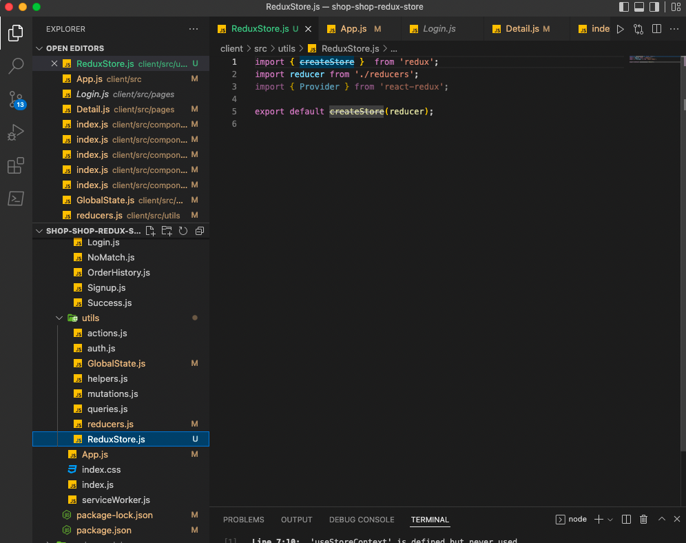

# SHOP-SHOP-REDUX-STORE

## Table of contents
1. [Title](#title)
2. [Description](#description)
3. [Installation](#installation)
4. [Usage](#usage)
5. [Contributing](#contributing)
6. [Test](#test)
7. [License](#license)
8. [Questions](#questions)

## Title
SHOP-SHOP-REDUX-STORE

## Description
challenge this week is to refactor the e-commerce platform from the module project so that it uses Redux (Links to an external site.). You won’t need to make sweeping changes to the code, but you will need to read through the Redux documentation on your own to find the information you need. We’ve provided some guidelines to point you in the right direction in the Getting Started section below.

## Installation
Run `npm install` to install all packages and `npm run develop` to test locally. Once everything is good deploy to Heroku or other cloud provider or host in our hosting environment (CentOS or Ubuntu)

## Usage
Once application starts hit `http://localhost:3000` to test using browser and `http://localhost:3001` to test the graphql queries and such

## Contributing
Start cloning `main` branch and `create branch` once ready do a pull request

## Test
Always test on local environment

## License
[MIT](https://gist.github.com/nicolasdao/a7adda51f2f185e8d2700e1573d8a633#mit-license)

## Questions
No question at this time 
Find me on Github [kazichaska](https://github.com/kazichaska) 
Email me with any question: kazichaska@gmail.com  

## Deployed Application Video Link 
Below is the recorded video link of deployed application and how to use it:
https://calm-hollows-41642.herokuapp.com/ 

## Screenshots of the code

